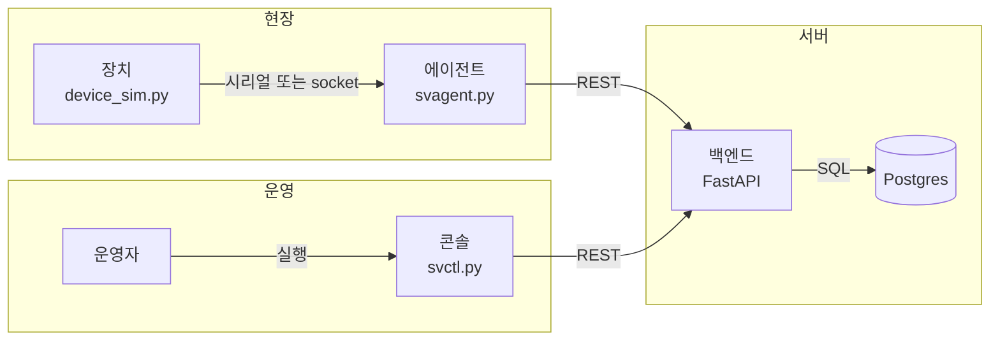

# 구성도

현장(장치·에이전트)과 운영(콘솔)이 백엔드 REST를 통해 Postgres에 모인다.
에이전트만 장치 프로토콜을 알고, 콘솔은 백엔드 API만 호출한다.

자세한 로직은 [seq_diagrams.md] 참고.

# 설계 결정 이유
### 1. 백엔드에서 동기(Sync)방식으로 구현한 이유
비동기 방식은 Coroutine이 I/O 대기 중 실행권을 반환함으로써 적은 수의 스레드로 많은 동시 요청을 효율적으로 처리할 수 있다는 장점이 있다.
하지만 본 시스템은 소수의 Agent와 Console이 Backend를 호출하는 구조이며, 지속적으로 많은 동시 연결이나 대규모 요청을 처리해야 하는 시스템은 아니다. 또한 FastAPI의 동기 핸들러는 Thread Pool에서 실행되므로, DB와 같은 Blocking I/O가 발생하더라도 다른 요청을 별도의 스레드에서 처리할 수 있다.
따라서 현재 요구사항에서는 비동기 구현으로 얻을 수 있는 이점보다 DB Driver, Connection Pool, Transaction, Test 등 전체 I/O 계층을 비동기로 일관되게 구성하기 위한 복잡성이 더 크다고 판단하여 동기 방식으로 구현하였다.
향후 WebSocket과 같은 장기 연결을 사용하거나 다수의 외부 API를 동시에 호출하는 등 높은 I/O 동시성이 요구될 경우 비동기 방식으로의 전환을 재검토할 수 있다.

### 2. 동기 방식으로 구현할건데 FastAPI 선택한 이유
동기만 필요하다면 WSGI인 Flask가 더 단순하다. 그래도 FastAPI(ASGI)를 고른 이유는 요청 모델이 곧 Pydantic 검증이고, 그 스키마가 OpenAPI로 같이 나오기 때문이다. ASGI 이벤트 루프의 이득을 쓰려 한 선택은 아니고, 핸들러를 동기로 두면 생기는 스레드풀 오버헤드는 감수하기로 했다.

### 3. DB 스키마에 FK를 넣지 않은 이유
현재 시스템은 적재/조회 위주이고, 장치 삭제 시 이력과 명령을 어떻게 처리할지는 아직 정하지 않았다. FK는 부모를 지울 때 자식을 막을지 같이 지울지 같은 정책을 DB에 먼저 고정한다. 그 정책을 정한 뒤에 제약을 다는 편이 맞다고 판단하였다. 없는 장치에 데이터가 쌓이면 안 되므로, 그 보장은 _require_device로 애플리케이션 레벨에서 했다.

### 4. 에이전트에서 쓰레드를 2개 구성한 이유
시리얼 readline이 블로킹이라, 같은 루프에서 하트비트·pending을 보내면 그 HTTP가 끝날 때까지 ACK와 DATA를 읽지 못한다. 그래서 장치 I/O는 device_loop, 주기성 HTTP(하트비트, pending, 타임아웃 보고)는 api_loop로 나눴다. DATA는 도착 즉시 올리려고 업로드 POST는 device_loop에 두어 업로드 전용 큐는 만들지 않았다. 그 대가로 다음 readline은 업로드 POST가 끝날 때까지 기다린다.

### 5. 에이전트에서 명령처리를 위한 큐를 2개로 분리한 이유
하나의 큐에 넣으면 ‘아직 장치에 전달하지 못한 명령’과 ‘전달하고 응답을 기다리는 명령’의 deadline과 실패 정책이 섞인다. waiting_pending_queue는 연결·쓰기 실패 시 FAILED, processing_pending_queue는 3초 무응답 시 FAILED다. 전자에 넣었다가 장치에 명령을 보낸 뒤 후자로 옮겨 ACK/NACK 또는 타임아웃을 본다. 명령마다 응답 순서가 다를 수 있어 command_id로 중간 제거하려고 Queue 대신 list를 사용했다.

### 6. 하트비트의 기준을 장치 메시지로 지정한 이유
장치가 살아있다는 것은 에이전트가 판단한다. 기준은 시리얼이 붙어 있는지가 아니라, HELLO/DATA/ACK/NACK 메시지가 온 것으로 판단한다. 연결만 있고 메시지가 없으면 살아 있다고 보지 않는다. 하트비트 주기 안에 메시지가 없으면 하트비트를 보내지 않고, 백엔드는 마지막 하트비트 시각부터 30초가 지나면 OFFLINE으로 내린다. 따라서 PAUSE상태도 장치가 메시지를 보내고 있지 않는 것이기에 OFFLINE으로 판단한다.

### 7. OFFLINE 강등을 모니터링 쓰레드로 한 이유
요구사항만 충족한다면 조회 시 last_heartbeat_time을 기준으로 상태를 계산할 수 있다. 하지만 본 구현에서는 상태 전이 자체를 운영 이벤트로 기록하기 위해 명시적인 ONLINE/OFFLINE 전이를 선택했다. 요청이 없는 동안에도 OFFLINE 전이를 감지해야 하므로 별도의 모니터링 스레드가 주기적으로 상태를 확인한다.

### 8. 규칙평가에서 텔레메트리 저장과 임계점에 따른 명령처리를 SAVEPOINT로 분리한 이유
장치에 대해 운영자가 설정한 규칙이 존재한다면, 텔레메트리로 온도가 들어왔을 때 이 온도가 규칙에 의한 명령 생성될지를 판단하는 로직을 거치게 된다. 그런데 규칙평가 및 명령생성의 로직이 앞선 텔레메트리 수집 및 저장에 영향을 미치면 안되므로 이를 하나의 트랜잭션으로 넣되 로직이 넘어오는 지점을 SAVEPOINT로 지정하였다. 따라서 규칙평가 로직이 실패하더라도 텔레메트리는 정상 저장되도록 보장하였다.
