# 시퀀스 다이어그램

| 객체   | 역할                                                        |
| ---- | --------------------------------------------------------- |
| 장치   | 시뮬레이터. HELLO / DATA / ACK / NACK 송신, CMD 수신               |
| 에이전트 | `agent/svagent.py`. 시리얼과 백엔드 REST를 중계                     |
| 백엔드  | `backend/app.py`. 등록, 하트비트, 텔레메트리, pending, 명령 상태, 임계치 규칙 |
| 콘솔   | `console/svctl.py`. 운영자. 명령 생성, 임계치 설정, 상태 조회 (평가·제어 포함)  |

---

## 1. 장치 등록

에이전트 기동 시 최초 1회 `POST /api/v1/devices`.

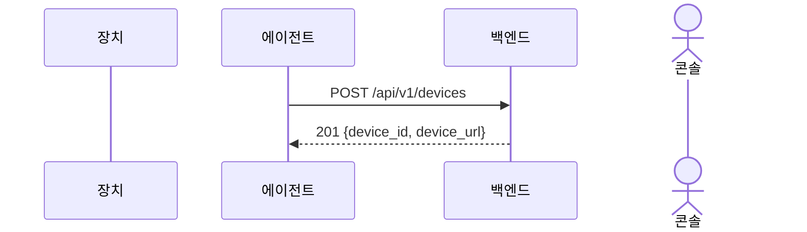

---

## 2. 장치 연결 (HELLO)

에이전트가 데이터 포트에 붙으면 장치가 HELLO를 한 번 보낸다.

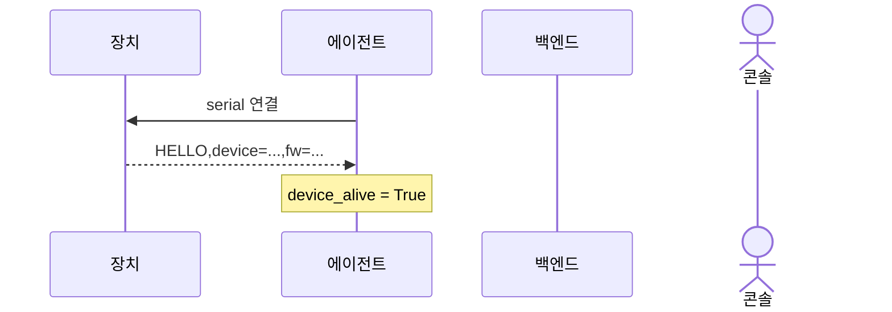

---

## 3. 텔레메트리 (DATA)

장치가 5초마다 DATA를 보내고, 에이전트가 백엔드에 업로드한다.

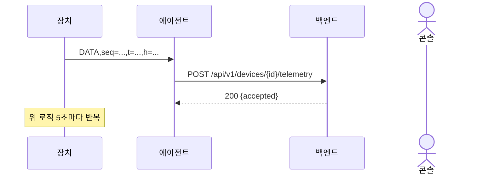

---

## 4. 하트비트

에이전트는 10초마다 하트비트를 **보낼지** 본다. HELLO / DATA / ACK / NACK가 한 번이라도 있으면 `device_alive = True`.
하트비트를 성공하면 다시 `False`로 둔다. 다음 10초 안에 장치 말이 없으면 하트비트는 보내지 않는다.
백엔드가 30초 동안 하트비트를 못 받으면 OFFLINE으로 내리는 전이는 8번.

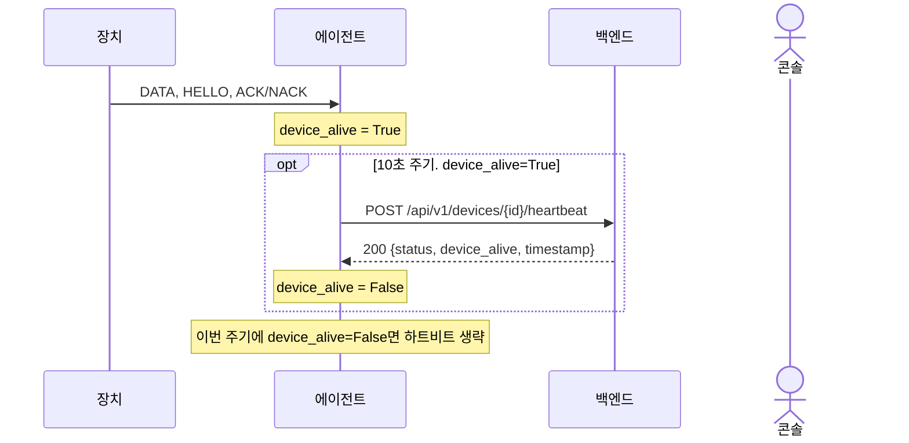

---

## 5. 명령 전달

콘솔이 백엔드로 명령을 전달한다. 에이전트는 그 명령들을 2초 주기로 읽어 장치에게 명령한다.
응답(ACK/NACK)대기 시간은 3초이고, 그 이상은 FAILED로 보고한다.
콘솔이 ACK/NACK/FAILED를 기다리는 흐름은 10번. 

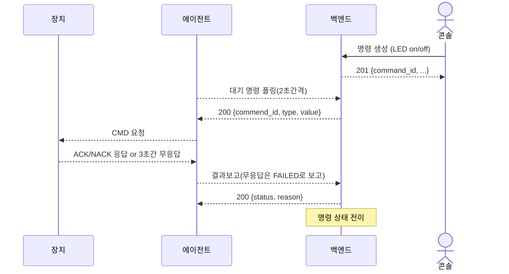

---

## 6. 임계치 규칙

콘솔이 장치별 온도 임계치를 저장한다. `last_action` 기본값은 `OFF`.
텔레메트리가 올 때마다 백엔드가 규칙을 본다. 온도가 임계치보다 높고 `last_action`이 OFF이면 LED ON, 온도가 임계치보다 낮고 `last_action`이 ON이면 LED OFF.
같은 방향 명령을 반복하지 않도록 `last_action`을 갱신한다. 만들어진 명령은 5번으로 전달한다.

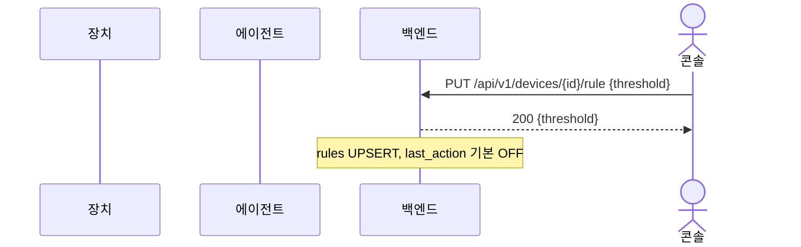

텔레메트리가 오면 규칙을 평가해 명령을 만들 수 있다.

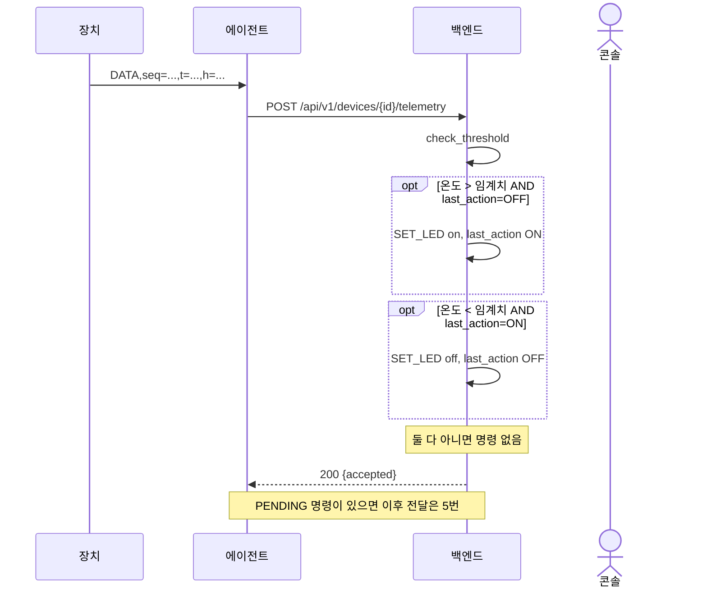

---

## 7. 장치 연결 끊김 / 재연결

시리얼이 끊기면 에이전트가 닫고 다시 붙는다.

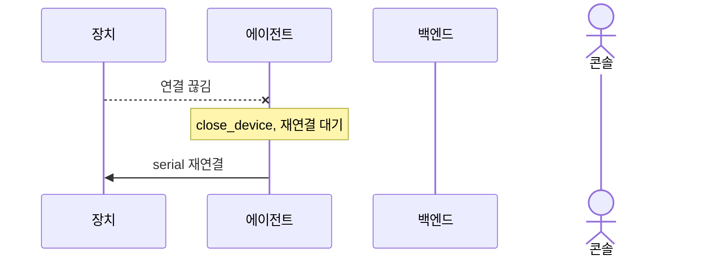

---

## 8. ONLINE / OFFLINE

백엔드 모니터는 1초마다 `last_heartbeat_time`을 본다. ONLINE 장치가 30초 동안 하트비트가 없으면 OFFLINE으로 내리고 `event_logs`에 OFFLINE을 넣는다.
OFFLINE 장치에 하트비트가 오면 ONLINE으로 올리고 `event_logs`에 ONLINE을 넣는다. 이미 ONLINE이면 시각만 갱신한다.

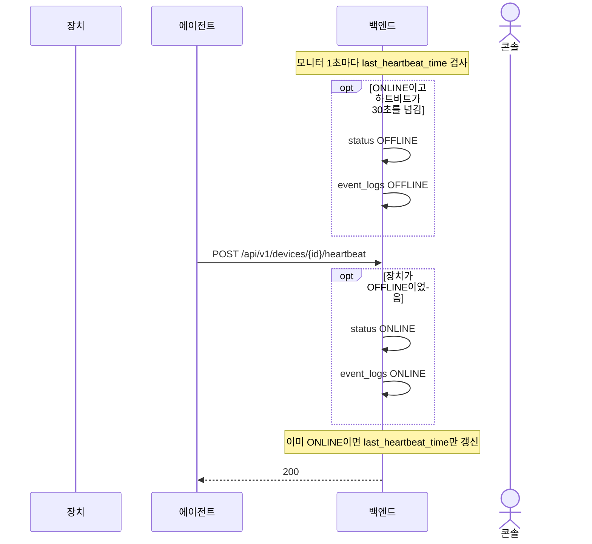

---

## 9. 콘솔 조회

운영자는 콘솔로 장치 목록, 상세, 규칙, 명령 목록, 텔레메트리 이력을 읽는다.

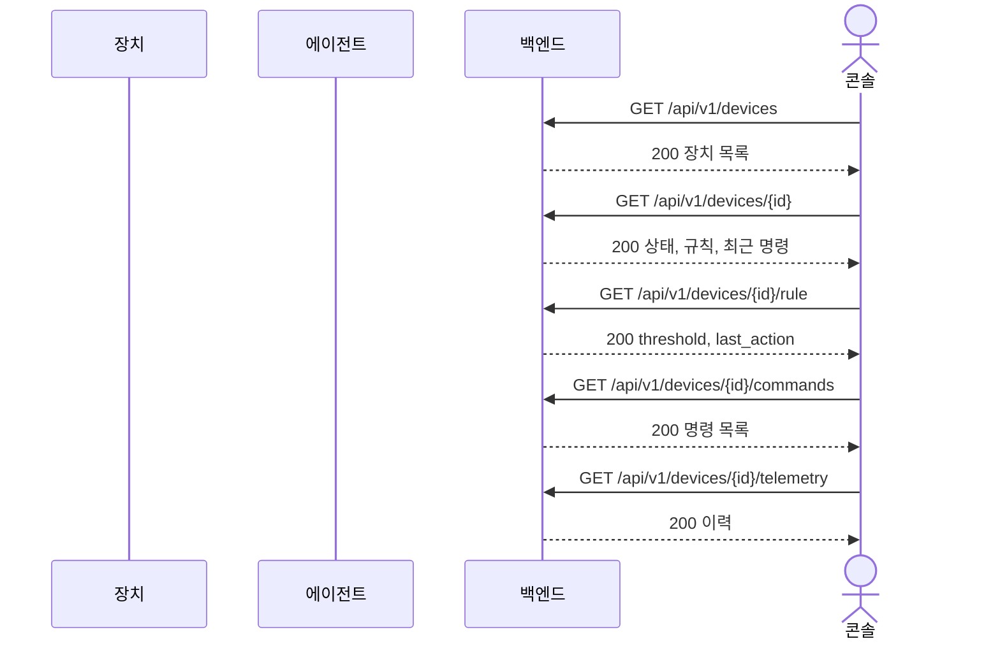

---

## 10. 콘솔 LED 대기

`svctl led`는 명령을 만든 뒤, 최대 5초 동안 단건 조회로 ACK / NACK / FAILED를 기다린다.
에이전트가 장치를 거쳐 상태를 올리는 과정은 5번과 같다.

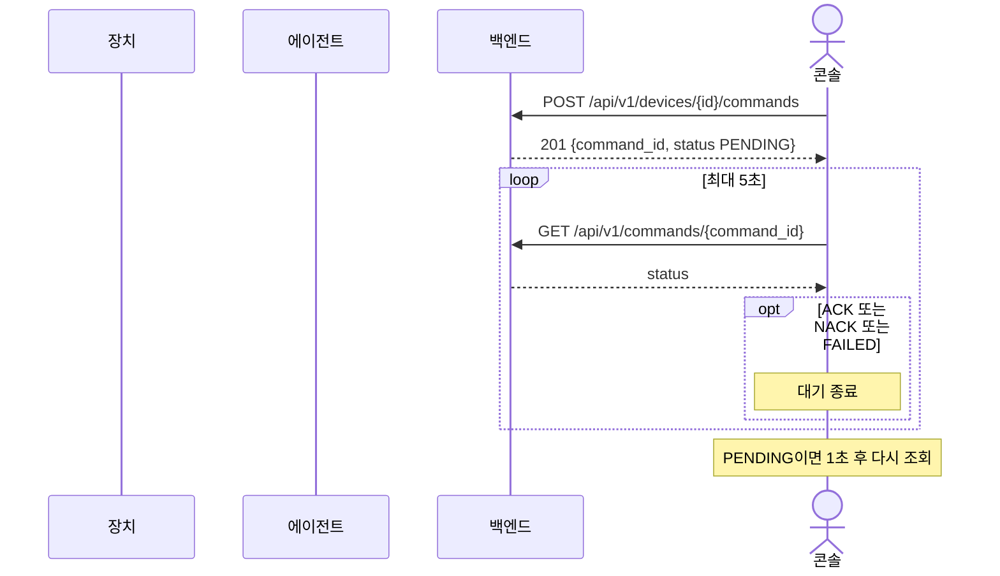

