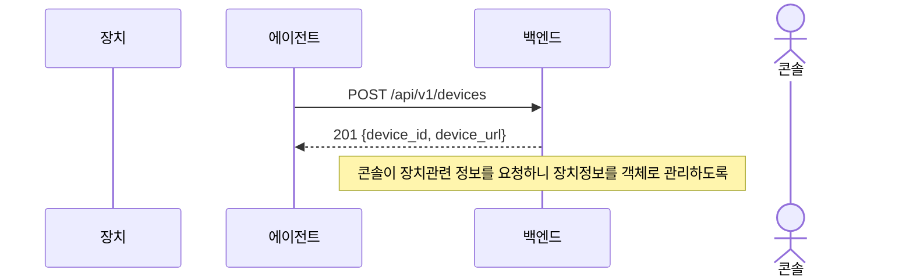
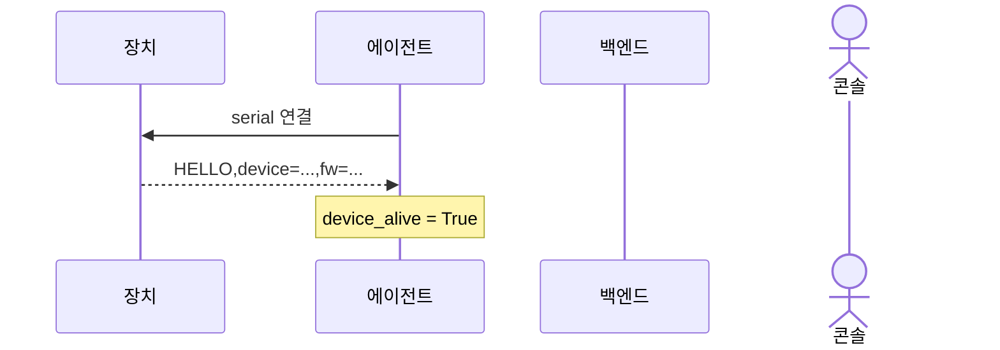
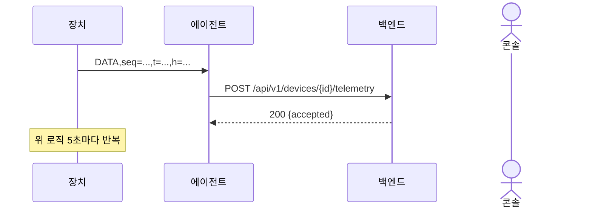
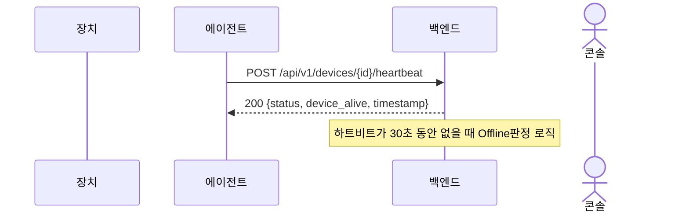
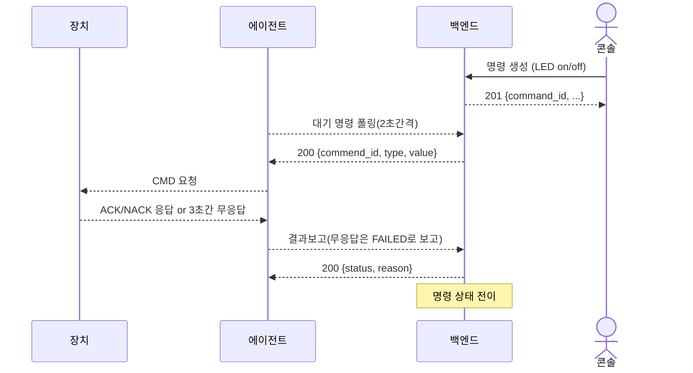
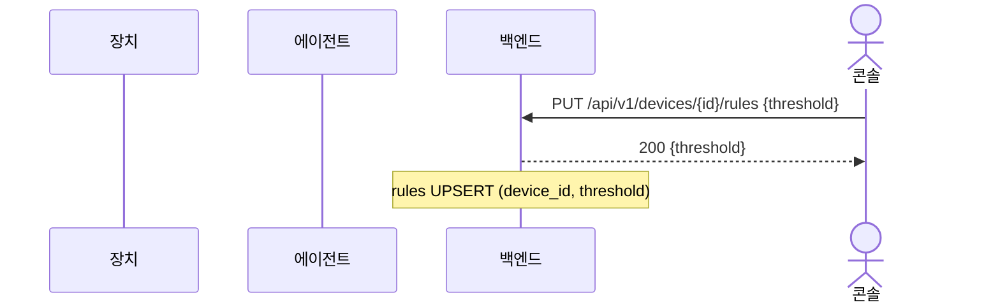
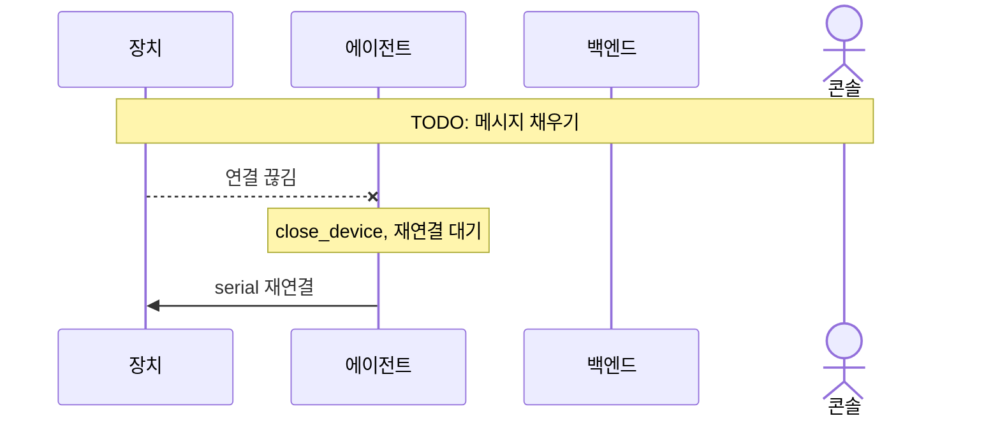

# 시퀀스 다이어그램

참여자(객체)는 모든 그림에서 동일하다.

| 객체 | 역할 |
|---|---|
| 장치 | 시뮬레이터. HELLO / DATA / ACK / NACK 송신, CMD 수신 |
| 에이전트 | `svagent.py`. 시리얼과 백엔드 REST를 중계 |
| 백엔드 | `backend/app.py`. 등록, 하트비트, 텔레메트리, pending, 명령 상태, 임계치 규칙 |
| 콘솔 | 운영자. 명령 생성, 임계치 설정, 상태 조회 (평가·제어 포함) |

---

## 1. 장치 등록

에이전트 기동 시 최초 1회 `POST /api/v1/devices`.

---

## 2. 장치 연결 (HELLO)

에이전트가 데이터 포트에 붙으면 장치가 HELLO를 한 번 보낸다.

---

## 3. 텔레메트리 (DATA)

장치가 5초마다 DATA를 보내고, 에이전트가 백엔드에 업로드한다.

---

## 4. 하트비트

에이전트가 10초마다 장치 생존을 백엔드에 보고한다. 
장치의 생존여부 판단기준: 장치가 5초마다 에이전트에게 보내는 DATA가 있을 떄 생존으로 판단. 하트비트 전송했을 때 다시 사망으로 간주하며 다음 하트비트 전송까지 DATA가 오면 생존으로 하트비트 전송, 아니라면 그대로 사망으로 판단하고 하트비트 전송X

---

## 5. 명령 전달

콘솔이 백엔드로 명령을 전달한다. 에이전트는 그 명령들을 2초 주기로 읽어 장치에게 명령현다. 
응답(ACK/NACK)대기 시간은 3초이고, 그 이상은 FAILED로 보고한다. 

---

## 6. 임계치 규칙

콘솔이 장치별 온도 임계치를 저장한다. `last_action` 기본값은 `OFF`.
백엔드는 텔레메트리가 올 떄마다 이 임계치를 기준으로 규칙판정을 한다. 임계치 이상이면 LED OFF, 이하면 LED ON 명령.
다만, 중복명령이 되지 않도록 이전 명령을 기억한다. 명령전달은 위 5번을 통해서 진행.

---

## 9. 장치 연결 끊김 / 재연결

시리얼이 끊기면 에이전트가 닫고 다시 붙는다.

